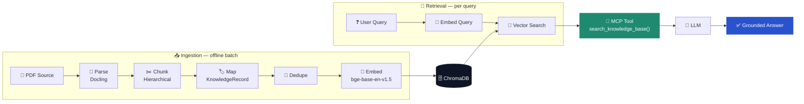

<div align="center">

# 🧠🔍 Building a Retrieval-Augmented Generation (RAG) Pipeline


### From PDF Ingestion to MCP-Powered Semantic Search

[](https://www.python.org/)
[](https://github.com/DS4SD/docling)
[](https://www.sbert.net/)
[](https://www.trychroma.com/)
[](https://github.com/modelcontextprotocol)
[](#-license)
[](https://sprcool.github.io/Vector_DB_MCP/)

</div>

---

## ✨ What is this?

**Vector_DB_MCP** turns a source PDF into a semantically searchable knowledge base — and exposes it to any [MCP](https://modelcontextprotocol.io/)-aware client as a single callable tool. No more hallucinated answers from a document your model never saw: it parses, chunks, embeds, and indexes your content, then serves grounded, cited passages straight into an LLM's context window.

> 🧠 **Why RAG?** LLMs are frozen at training time. Retrieval gives them an open book — relevant passages, fetched at query time, so answers are grounded in something real instead of reconstructed from memory.

📚 **[Read the full documentation site →](https://sprcool.github.io/Vector_DB_MCP/)**

---

## 🚀 Features

- 📄 **PDF ingestion** via [Docling](https://github.com/DS4SD/docling) — structure-aware parsing, not just raw text extraction
- ✂️ **Hierarchical chunking** along real section/heading boundaries, so context stays coherent
- 🔑 **Deterministic chunk IDs** (SHA-256) → idempotent, safe-to-rerun ingestion
- 🧹 **Automatic deduplication** before the expensive embedding step
- 🧬 **Local embeddings** with `BAAI/bge-base-en-v1.5` (768-d) via Sentence Transformers
- 🗄️ **Persistent vector storage** in ChromaDB — one collection, upsert on ingest, cosine search on retrieval
- 🔎 **Semantic retrieval** with page + heading metadata preserved for traceability
- 🔌 **MCP-native** — a single `search_knowledge_base` tool, ready for any MCP client
- 🧩 **Modular, typed, extensible** — every stage is a small dataclass-driven module

---

## 🏗️ Architecture



👉 Full diagrams (system architecture, sequence flow, data model) live on the **[docs site](https://sprcool.github.io/Vector_DB_MCP/architecture.html)**.

---

## 🧩 Pipeline stages

| # | Stage | Module | What happens |
|---|-------|--------|---------------|
| 01 | 📄 Document Ingestion | `config.py` | Fixes source PDF, model, and collection paths |
| 02 | 🧩 Document Parsing | `document_parser.py` | PDF → structured Docling document |
| 03 | ✂️ Semantic Chunking | `chunker.py` | Hierarchical, section-aware chunks |
| 04 | 🏷️ Metadata Mapping | `chunk_mapper.py` | Chunk → `KnowledgeRecord` + deterministic hash ID |
| 05 | 🧹 Deduplication | `deduplicator.py` | Collapse duplicate records by content hash |
| 06 | 🧬 Embedding Generation | `embeddings.py` | Text → 768-d vector (`bge-base-en-v1.5`) |
| 07 | 🗄️ Vector Indexing | `vector_store.py` | Upsert into ChromaDB |
| 08 | 🔎 Semantic Retrieval | `retrieval_service.py` | Question → embed → search → ranked results |
| 09 | 🔌 MCP Integration | `mcp_server.py` | Exposes retrieval as the `search_knowledge_base` MCP tool |

---

## 🛠️ Tech stack

| Layer | Technology |
|---|---|
| 🐍 Language | Python 3.10+ |
| 📄 Document parsing | [Docling](https://github.com/DS4SD/docling) |
| 🧬 Embeddings | [Sentence Transformers](https://www.sbert.net/) · `BAAI/bge-base-en-v1.5` |
| 🗄️ Vector database | [ChromaDB](https://www.trychroma.com/) |
| 🔌 Protocol | [FastMCP](https://github.com/modelcontextprotocol) |
| 🔑 Integrity | SHA-256 deterministic chunk IDs |
| 🧱 Data shapes | Python `dataclasses` (`KnowledgeRecord`, `EmbeddedKnowledgeRecord`, `SearchResult`) |

---

## ⚡ Getting started

```bash
# 1️⃣ Clone
git clone https://github.com/Sprcool/Vector_DB_MCP.git
cd Vector_DB_MCP

# 2️⃣ Create a virtual environment
python -m venv .venv
source .venv/bin/activate      # .venv\Scripts\activate on Windows

# 3️⃣ Install dependencies
pip install docling sentence-transformers chromadb "mcp[cli]"

# 4️⃣ Configure paths in Knowledge_Base/Scripts/config.py
#    → point PDF_PATH at your source document

# 5️⃣ Run ingestion 🧬
python -m Scripts.ingest

# 6️⃣ Start the MCP server 🔌
python mcp_server.py
```

Then connect any MCP client to `mcp_server.py` and start asking questions. 🎉

---

## 💬 Example query

```python
>>> search_knowledge_base("What is Azure Data Factory?", top_k=2)

[
  {
    "id": "3f9a1c…",
    "text": "Azure Data Factory is a cloud-based data integration service…",
    "heading": "Overview > Key Services > Azure Data Factory",
    "page": 4,
    "source": "AZURE_DATA_ENGINEERING_BROCHURE.pdf",
    "distance": 0.184
  }
]
```

📖 Full request/response schema: **[API reference →](https://sprcool.github.io/Vector_DB_MCP/api.html)**

---

## 📂 Project structure

```
Vector_DB_MCP/
├── 🔌 mcp_server.py            # FastMCP entry point
├── 🧠 Knowledge_Base/
│   ├── 📄 PDF_Source/           # source documents
│   ├── 🗄️ Vector_DB/            # ChromaDB storage (generated)
│   └── 🧩 Scripts/
│       ├── config.py
│       ├── models.py
│       ├── document_parser.py
│       ├── chunker.py
│       ├── chunk_mapper.py
│       ├── deduplicator.py
│       ├── embeddings.py
│       ├── vector_store.py
│       ├── retrieval_service.py
│       └── ingest.py
└── 📚 docs/                     # documentation site (GitHub Pages)
```

---

## 🗺️ Roadmap

- 🔀 Hybrid search (dense + keyword)
- 🎯 Cross-encoder re-ranking
- 🏷️ Metadata filters (source, page, heading)
- ♻️ Incremental ingestion
- 📡 Streaming responses
- 🤖 Agentic RAG
- 📚 Multi-document collections
- 🖼️ Multimodal RAG (tables, figures, images)

Full details on the **[roadmap page →](https://sprcool.github.io/Vector_DB_MCP/roadmap.html)**

---

## 📄 License

MIT — see [`LICENSE`](./LICENSE) for details.

<div align="center">

Made with 🧠 + 🤖 + ☕

</div>
